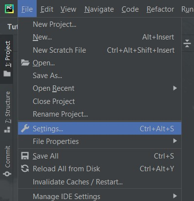
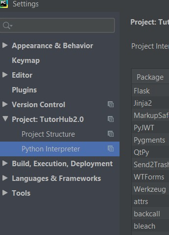
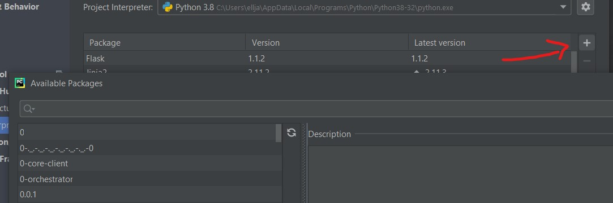
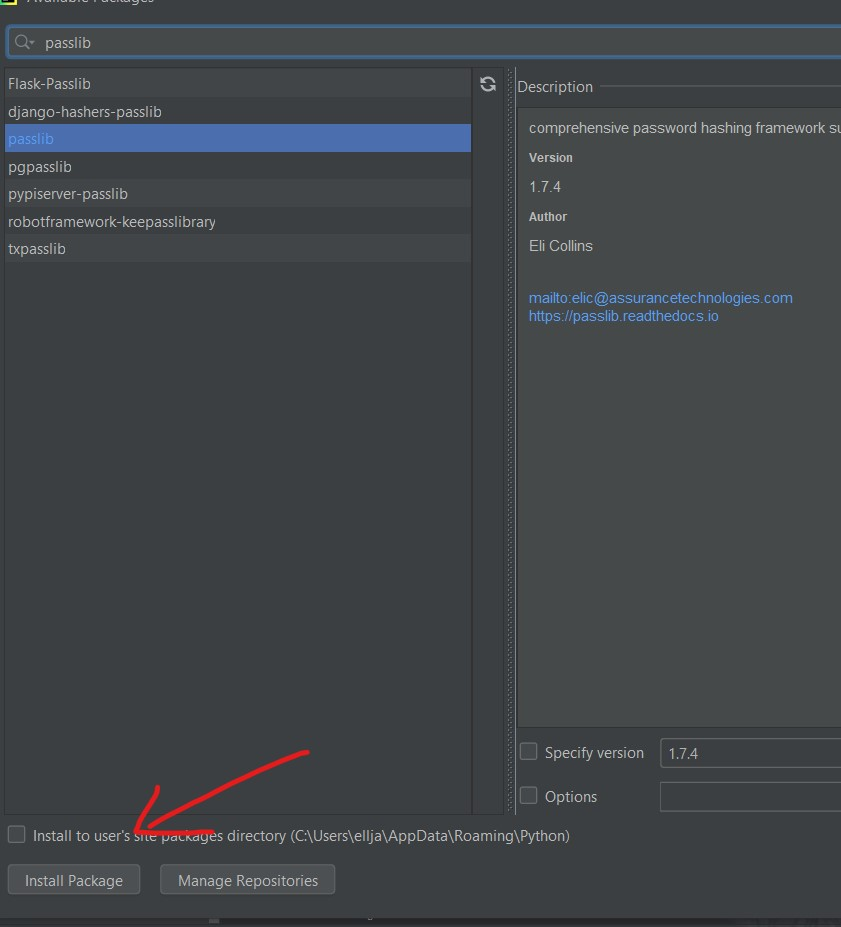

# App Dev Project - TutorHub   IT2005

Team Members: Lim Jing Kai, Sampang Erika, Christopher, Nuzul Firdaly

## Short Description
### What is the problem?
Due to Covid-19, businesses around the world were heavily affected. This was especially true for businesses which require physical interactions between customer and staff.

**Efforts**

To mitigate the effects of Covid-19, businesses all over the world made a large shift onto online platforms. This not only retained sales but even led to an increase in sales. However, because of the increased competition due to companies digitising their business, companies which do not want to go bankrupt has to follow the trend.

**Tuition Centres**

As one of the businesses which are affected greatly by Covid-19, to sustain the business, tuition businesses have to undergo transformation for a more reliable source of revenue. Why we say this is because tuition businesses often experience peaks and troughs in revenue. E.g. More income during exam periods, Less income during holiday seasons.

### Our Solution

To cater and hopefully solve this outstanding issue, our group has revamped the business model and made an application. This then leads to our solution 'TutorHub'. 

**Overall Idea**

* A platform which brings together teachers and learners alike; All users who sign up will be a learner by default. Even after registering as a tutor, learning capabilities (registering for courses) are still applicable.

* Shifting to online but not losing out on the interactive aspect. (Sessions will be conducted live to ensure lessons are interactive.)

**Functionalities**

[View the list of all the CRUDs here](https://docs.google.com/document/d/1PNn80U-BiNYCFPRJ1lkeLN0dmFaiL5DQNnr84mmoV90/edit?usp=sharing)

**Simple Demonstration**

Video Link: [Demonstration video of application]()

## Getting Started

Pycharm External Modules(need to install this to run flask app):
* Werkzeug version 1.0.1
* Passlib version 1.7.4
* Email-validator version 1.1.2

Go to File -> Settings

Click on Python Interpreter

Click on '+' icon and enter name of package into search bar

Select the package with the correct version then click 'Install Package'

